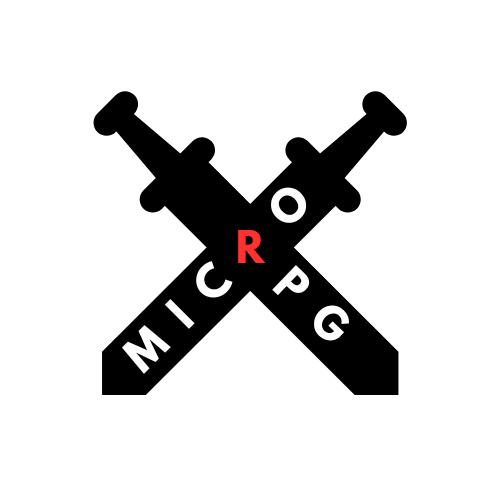
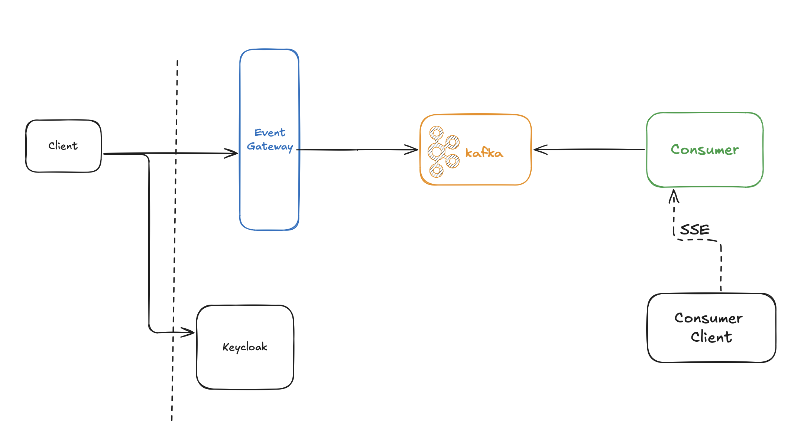

  
 

# Micro RPG

A simple PoC for event driven RPG game. It uses spring boot as event gateway for producing messages to confluent's kafka and keycloak for securing the gateway.

## Components

- consumer - minimalistic API for consuming messages from kafka topic and sending them via SSE
  - contains client.html as GUI for consuming SSE 
- gateway - minimalistic event gateway, producing new messages to kafka topic
- keycloak - authorization server
- kafka
  - base kafka brokers (confluent)
  - confluent schema registry
  - confluent control center as a GUI to kafka
  